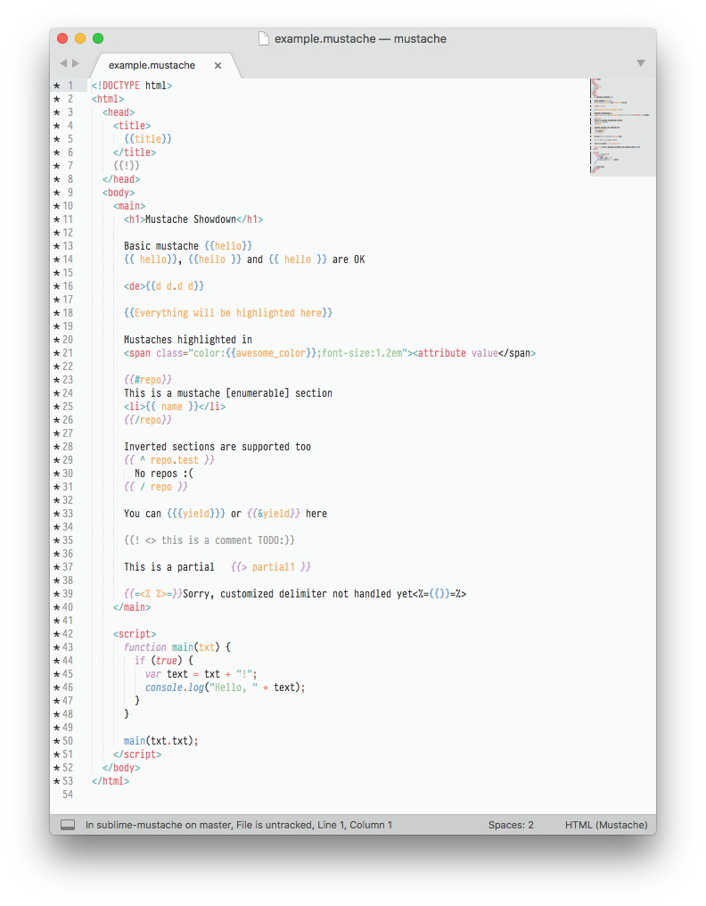
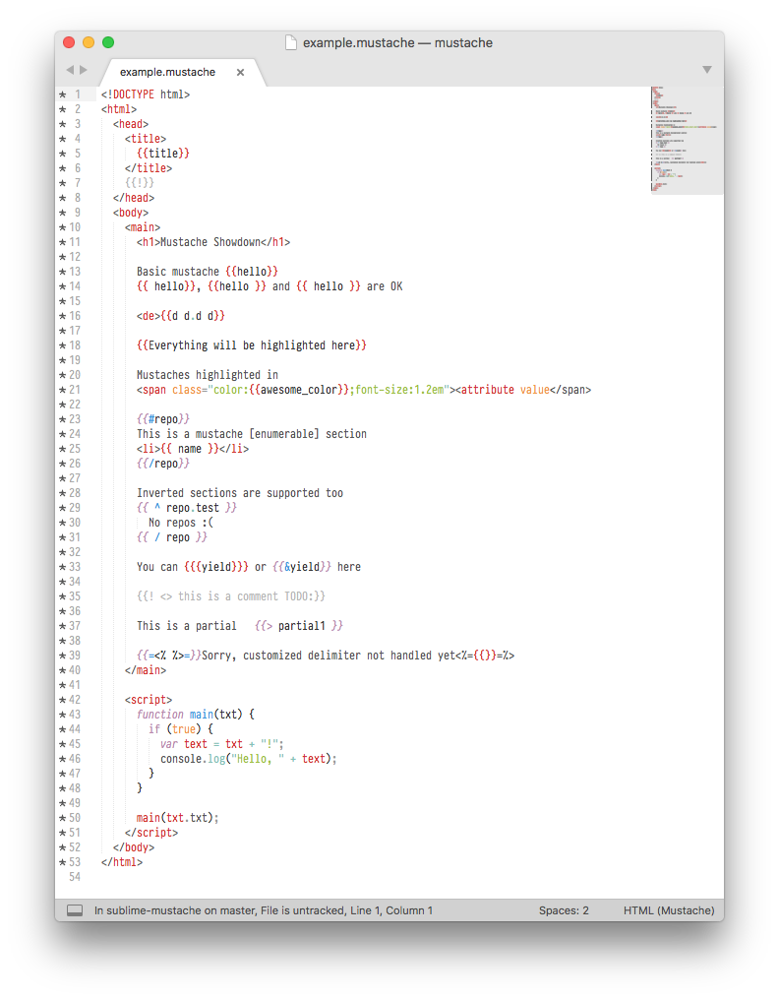

# Sublime Mustache

Mustache Syntax Definitions and Snippets for Sublime Text 3

## Snippets

| Name               | Trigger  | Result                                 |
|:-------------------|:---------|:---------------------------------------|
| Escaped Variable   | `var`    | `{{ variable }}`                       |
| Unescaped Variable | `let`    | `{{{ variable }}}`                     |
| Comment            | `!`      | `{{! comment }}`                       |
| Section            | `if`     | `{{# variable }} [..] {{/ variable }}` |
| Inverted Section   | `else`   | `{{^ variable }} [..] {{/ variable }}` |
| Partial            | `inc`    | `{{> partial }}`                       |

## Screenshots

### Monokai

### Mariana

### Breakers

### Sixteen

